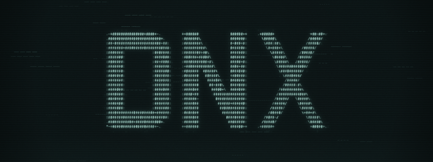
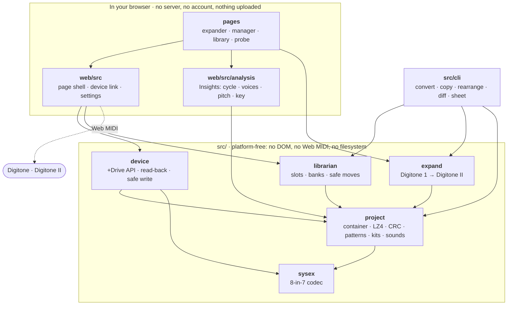

# DNX

**Tools for Elektron Digitone and Digitone II projects, in your browser.**
**→ [noiseandmatter.github.io/DNX](https://noiseandmatter.github.io/DNX/)**

Expand a Digitone 1 sketch onto a Digitone II's sixteen tracks. Move patterns between slots,
banks and projects. Browse and rename presets on the +Drive. Back the whole instrument up. Read
what a pattern actually plays.

Nothing is installed and nothing is uploaded. The page talks to the instrument over Web MIDI and
does all its work locally — DNX has no server and no account.

> **v0.9.0-beta.1.** It reads and writes real instruments and has been used on them, but it is a
> beta and it says so. Read *Before you point it at an instrument* below.

## What it does

**Expander** — a Digitone 1 has four tracks, so a busy sketch ends up with several sounds crammed
onto one, switched by sound-locking individual trigs. The expander gives each of those sounds its
own track on the Digitone II's sixteen, carrying the trigs, the locks and the parameter locks
with it. Source from a file, from a connected Digitone 1, or from its +Drive.

**Manager** — move, copy, swap, clear and rename patterns across a project's banks, with undo.
Drill into a Digitone II pattern's sixteen tracks and do the same there. Open a project from a
file, from the +Drive, or read the one loaded on the instrument.

**Insights**, inside the manager — what a selected pattern actually plays. Polymeter and when the
tracks come round, what the PATTERN RESET costs, trigs stored past the end of a track that never
sound, voice pressure against the device's budget, pitch content and a key fit. Both instruments.

**Library** — browse the +Drive's 2,048 presets with their tags, search them, rename one on the
instrument, and drag presets into a project's sound pool.

**Backup** — every project and soundbank on the +Drive into one `.dnx` file, with a manifest.

**Probe** — for when something is wrong. Ask an instrument what it is, what firmware it runs and
which messages it answers; capture whatever it sends. It only ever sends messages classified as
reads.

## Before you point it at an instrument

DNX writes to hardware that costs more than the computer running it. The safeguards are not
incidental, and it is worth knowing what they are.

- **Writing is off until you turn it on.** The `WRITE` switch is in the toolbar of every page,
  and while it is armed the whole page is edged in red so you cannot be armed without seeing it.
- **A copy is saved before anything is replaced.** Renaming a preset or saving over a project
  writes the current contents to your computer first. That copy is the only undo there is.
- **Every write is read back and compared**, and says so when the read-back differs.
- **Destinations are checked against a fresh listing**, so a slot that filled up since you last
  looked is refused rather than overwritten.
- **Close Elektron Transfer and Overbridge first.** Sharing a MIDI port with them has truncated a
  directory listing to a third of its length and had one application's traffic read as another's
  answer. DNX now notices when something else is on the port and says so — but closing it is
  better than being warned about it.

**What DNX will not do**, on purpose: it will not write to the project currently loaded on the
instrument, it will not convert a Digitone II preset back to a Digitone 1, and it refuses rather
than guesses whenever the format is not understood well enough to be sure. Those refusals are
features. `docs/KNOWN-ISSUES.md` records what is unfinished and how each was found.

## What you need

- **A Chromium browser** — Chrome, Edge, Brave, Arc. Firefox and Safari implement no Web MIDI, so
  they cannot see an instrument at all; the front page says so rather than letting you find out
  one tool at a time.
- **A Digitone or a Digitone II** connected over USB, for anything involving an instrument.
  Working with project files needs no hardware.
- Nothing else. There is no install step.

Not everything is available on both instruments — the help has a chart, tool by tool.

## Something wrong?

Every page has a **report** button beside `help` and `settings`. It opens a filled-in issue on
GitHub with the version, the tool and your browser already attached, and shows you exactly what
that is before you post. It carries nothing about your music: no project, file, folder or preset
names.

DNX posts nothing itself and holds no credential — you press the button on GitHub, signed in as
yourself, which does mean a GitHub account is needed to file one.

## Where the format knowledge lives

Elektron publishes no format documentation for the Digitone family. Everything here was derived
from real files and from captures taken off the instrument, and **every claim in `docs/` carries
a status**: VERIFIED, SOLVED, DECODED, INFERRED, SPECULATIVE or UNKNOWN. Those words are
load-bearing — a field marked INFERRED has a name taken from its position in a related structure,
not from anything anybody measured.

**[`docs/README.md`](docs/README.md) says what is in there and which three to read first.** If you
are here for the file formats rather than for the tool, that is the part worth your time.

A few findings that appear in no public source:

- The Digitone II's product id is `0x15`.
- Project payloads are **LZ4-compressed** (linked blocks, 32 KB, shared dictionary) inside a ZIP.
  Windowed entropy reads 3.7–6.2 bits and looks nothing like compressed data, which is a trap.
- The check field is `crc32(payload[0x1F : len-12])` with a **zero init** — the CRC-32 polynomial,
  not the standard parameterisation.
- SysEx payloads are **8-in-7, MSB-first**, and the length field keeps only the low 14 bits, so it
  wraps on large dumps.
- A SysEx pattern payload equals a project pattern record plus its kit record byte for byte, so
  findings transfer between the two with no offset translation.

## How it is put together

Two front ends over one core. **`src/` is platform-free** — no DOM, no Web MIDI, no filesystem —
because it is the part proven byte-for-byte against Elektron's own output, and keeping it that way
is what lets a page, a command and a test exercise the same code.



**Every arrow points down and none point back.** `src/` imports nothing outside `src/`, and no page
imports another page's folder. That is checked rather than hoped for: the rule and what breaking it
has already cost are in [`docs/PRINCIPLES.md`](docs/PRINCIPLES.md).

A few consequences worth knowing before reading the code:

- **`sysex` is the floor.** Everything an instrument says arrives through the 8-in-7 codec, and
  everything written to one leaves through it.
- **`project` is where the format knowledge lives**, and it is the most depended-on module in the
  repository. `docs/` documents what it knows and marks each claim with its confidence.
- **`device` speaks the protocol; the browser carries it.** `src/device` composes and parses every
  +Drive message and owns the safeguards — the copy taken before a write, the read-back comparison,
  the fresh listing a destination is checked against — but it never touches a port. It asks for a
  transport, and `web/src` supplies one backed by Web MIDI. That is what lets the whole write path
  be tested without an instrument plugged in.
- **`analysis` describes patterns, not instruments.** Charts never learn what a Digitone is. Each
  device gets a *producer* that reads its own format and hands over a common shape, which is why
  Insights works on both without the charts knowing there are two.

## Running it yourself

```bash
npm install
npm run web      # builds and serves at http://127.0.0.1:8173
npm run verify   # the tests, plus both typecheck passes
```

`verify` is what CI runs and what to run before pushing. `npm test` alone does not typecheck:
`tsx` strips types rather than checking them, so a browser-only type reaching a Node test passes
the suite and fails `tsc`. That has happened.

There is also a command line, which does most of what the pages do and some things they do not —
`npm run project`, `plan`, `convert`, `copy`, `rearrange`, `rename`, `track`, `rebuild`, `diff`,
`sheet`. Each prints its own usage, and every one of them is a **dry run by default**.

### The test corpus is not in this repository

Many tests validate against real Digitone projects, and those files are the author's own music.
The corpus is found at run time: `DN_CORPUS` if set, otherwise a sibling `dn_sysex/00_Examples/`.
Without it those tests **skip** rather than fail, so a fresh clone still runs a green suite over
the codec, the container, the placement rules and everything else that needs no music.

```
<corpus>/01_DN1/01_Projects/*.dnprj       Digitone 1 projects
<corpus>/01_DN1/02_Sounds/*.syx           Digitone 1 sound banks
<corpus>/02_DN2/01_Projects/*.dn2prj      Digitone II projects
<corpus>/02_DN2/reference_captures/*.syx  native Digitone II SysEx captures
```

`.gitignore` refuses project and sound files outright, as a safety net.

## Prior art

- [`emnyeca/digitone-syx-toolkit`](https://github.com/emnyeca/digitone-syx-toolkit) — 424
  single-variable Digitone II pattern captures. The most valuable public artifact for this work.
- [`mzero/elk-herd`](https://github.com/mzero/elk-herd) — Digitakt project editor; the model for
  versioned structs and for preserving unknown regions verbatim.
- [`bsp2/libanalogrytm`](https://github.com/bsp2/libanalogrytm) — Analog Rytm structures.
- [`ashojaeddini/digitools`](https://github.com/ashojaeddini/digitools) — Digitone 1 sound tags.

**Nothing in `src/` is copied from another project.** Two files name one anyway, because the
design came from somewhere and saying so is cheaper than being asked: `src/librarian/shuffle.ts`
follows the *shape* of elk-herd's `Bank.Shuffle` (BSD 2-Clause, Mark Lentczner), separating a
described reordering from its application; `src/device/safewrite.ts` reaches the same six-step
write sequence as digi-roll's `safe-write.js`, independently — its licence is unstated and its
code was not read.

## Licence

**[GNU AGPL-3.0-or-later](LICENSE).** In plain terms:

- **Use it for anything, including work you are paid for.** A licence covers the software, not
  what you make with it. Sequence an album with DNX and sell the album; that is what it is for.
- **Fork it, change it, share it.** Keep the notices, and pass on the same freedoms you got.
- **A modified version stays open.** If you distribute one, or run one as a service other people
  use, its source has to be available to them. DNX runs in a browser, so the second case is the
  likely one, which is why every page carries a **source** link: section 13 requires the offer,
  and the interface is the only place it can live for a page nobody downloads.

If you want to build something closed on top of this, ask. A separate licence is available and the
copyright is in one pair of hands, so it is a conversation rather than a legal project.

---

DNX is an independent project. It is **not affiliated with, endorsed by or supported by
Elektron**, and *Digitone*, *Digitakt*, *Overbridge* and *Transfer* are their trademarks. Point it
at your instrument at your own risk.
